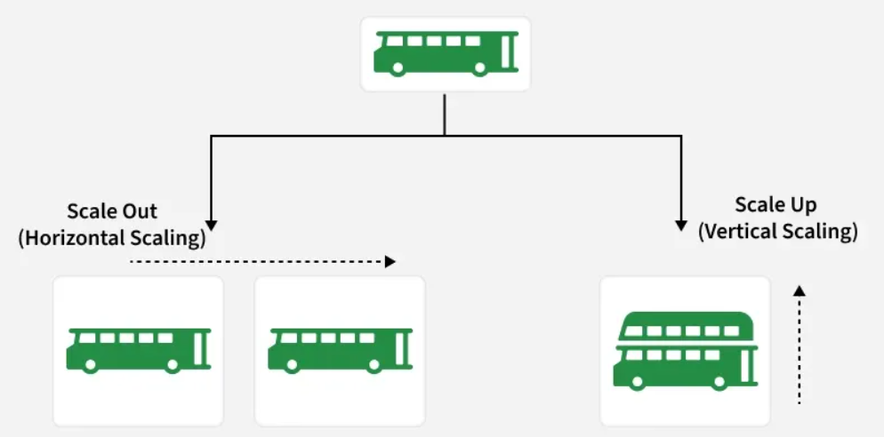

# Scalability

## What is Scalability?

Scalability refers to a **system's ability to grow smoothly and handle increased demand** while maintaining performance, reliability, and efficiency.

- Handles rising user traffic and workload effectively
- Supports growth in data and computing needs
- Maintains performance under increased load
- Avoids major redesign during expansion

---

## Importance of Scalability in System Design

| Benefit | Description |
|---|---|
| **Managing Growth** | Handles more users, data, and traffic without losing speed or reliability |
| **Improving Performance** | Distributes load across resources for faster processing and responses |
| **Ensuring Availability** | Keeps systems running during traffic spikes or component failures |
| **Cost-effectiveness** | Scales resources up or down as needed, reducing unnecessary costs |
| **Encouraging Innovation** | Makes it easier to add new features and adapt to market changes |

---

## How to Achieve Scalability

### a. Make It Bigger (Vertical Scaling)
Like upgrading a car with a bigger engine for more power.
- In tech: adding CPU, memory, or storage to the same server.
- Suitable for small applications and quick scaling needs.
- Limited by hardware — upgrades can't continue indefinitely.

### b. Get More Cars (Horizontal Scaling)
Like using multiple cars to share the workload.
- Adds more servers or instances instead of upgrading one.
- Distributes traffic evenly across resources.
- Ideal for large applications with many users.

### c. Divide and Conquer (Microservices)
- Treats the app as small, independent services.
- Scales only the required parts instead of the whole system.
- Improves flexibility and efficient resource usage.

### d. No Servers, No Problems (Serverless)
- Removes the need to manage servers.
- Automatically scales based on demand.
- Cost-efficient for variable and unpredictable workloads.

---

## Components That Help Increase Scalability

| Component | Description |
|---|---|
| **Load Balancer** | Distributes incoming traffic across multiple servers to avoid overload |
| **Caching** | Stores frequently accessed data temporarily to reduce latency and backend load |
| **Database Replication** | Creates multiple real-time copies of data to enhance availability and read performance |
| **Database Sharding** | Splits data into smaller shards to scale databases across multiple instances |
| **Microservices Architecture** | Divides applications into independent services that can scale separately |
| **Data Partitioning** | Divides data based on criteria like user or region to improve scalability |
| **Content Delivery Networks (CDNs)** | Delivers cached content from locations closer to users, reducing latency |
| **Queueing Systems** | Handles requests asynchronously to manage traffic spikes and prevent overload |

---

## Real-World Examples of Scalable Systems

| Company | How They Scale |
|---|---|
| **Google** | Uses a highly scalable distributed system (Bigtable, MapReduce, Spanner) to handle billions of searches globally |
| **AWS** | Offers scalable cloud services that let businesses scale compute, storage, and databases on demand |
| **Netflix** | Relies on cloud infrastructure, microservices, and caching to stream content to millions of users at once |

---

## Challenges and Trade-offs in Scalability

| Challenge | Description |
|---|---|
| **Cost vs. Scalability** | Scaling improves performance but often increases infrastructure and operational costs |
| **Complexity** | As systems scale, they become harder to manage, maintain, and debug |
| **Latency vs. Throughput** | Optimizing for low latency may reduce throughput, and vice versa |
| **Data Partitioning Trade-offs** | Partitioning boosts scalability but requires careful balance of partition size, data movement, and locality |
