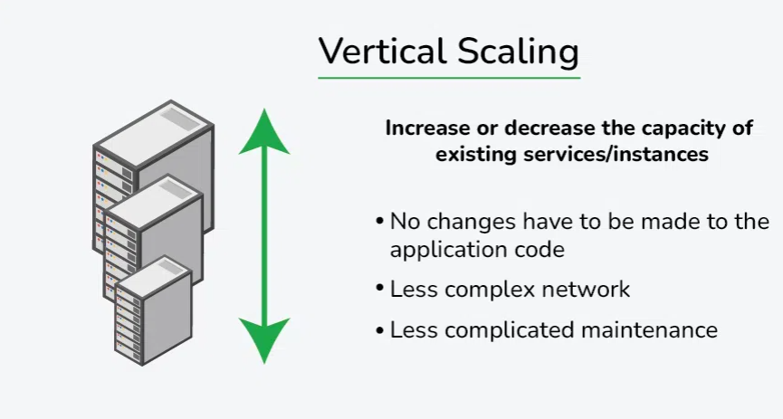
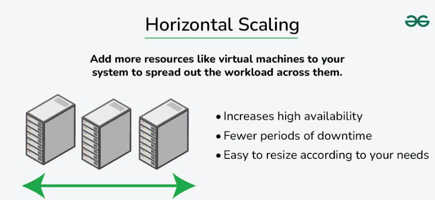

# Horizontal vs Vertical Scaling

## 1. Vertical Scaling (Scale Up)

Vertical scaling refers to the process of **increasing the capacity of an individual hardware or software component** within a system.

- We upgrade the same system rather than adding more systems — by adding better processors, increasing RAM, or other power-increasing adjustments.
- Simple to implement; useful for monolithic and small-scale applications.

**Examples:**
- Upgrading a MySQL server from 16 GB RAM to 64 GB to handle more queries.
- Moving a website hosted on a 2-core VM to an 8-core, higher-RAM VM to improve performance.
- E-commerce platform running on a single large AWS EC2 instance with increased resources (CPU, RAM, disk).

**Advantages:**
- Increased capacity: enhances server performance and ability to manage incoming requests.
- Easier management: upgrading a single node is usually simpler than maintaining several nodes.

**Disadvantages:**
- Limited scalability: constrained by the hardware's physical limitations.
- One server still receives all incoming requests, increasing the possibility of downtime on failure.
- Scaling up often requires restarting or replacing the machine, causing downtime.

---

## 2. Horizontal Scaling (Scale Out)

Horizontal scaling refers to the process of **increasing capacity by adding more machines or servers** to distribute the workload across a larger number of individual units.

- No need to change or replace the existing server.
- No downtime while adding more servers to the network.

**Examples:**
- A website adds more web servers behind a load balancer to handle traffic spikes.
- Netflix scales different microservices independently across regions.
- Amazon Auto Scaling spins up more EC2 instances during peak shopping hours (e.g., Black Friday).
- Akamai or Cloudflare uses globally distributed servers to serve content closer to users.

**Advantages:**
- Increased capacity: more nodes can handle a larger number of incoming requests.
- Improved performance: distributing load reduces the chance of any one server getting overloaded.
- Increased fault tolerance: if one node fails, requests can be sent to another node.

**Disadvantages:**
- Requires complex architecture (load balancers, distributed databases, etc.).
- Difficult to maintain strong consistency across distributed nodes.
- More machines means more networking, power, and maintenance.
- Needs orchestration tools (e.g., Kubernetes, Ansible) to manage many servers.
- Issues can spread across nodes, making root-cause analysis tricky.
- Communication between nodes adds latency and complexity.

---

## Comparison

| Aspect | Horizontal Scaling (Scale-Out) | Vertical Scaling (Scale-Up) |
|---|---|---|
| **Definition** | Adds more machines/servers to distribute workload | Enhances resources (CPU, RAM, storage) of an existing machine |
| **Resource Addition** | New servers or instances | More resources to one server |
| **Scalability Limits** | Virtually unlimited (can keep adding nodes) | Limited by hardware maximums |
| **Cost** | Higher initial infrastructure cost (more machines) | Lower initial cost (only upgrading one machine) |
| **Fault Tolerance** | High — if one node fails, others take over | Low — single node failure affects whole system |
| **Performance** | Can increase almost linearly with nodes | Improves up to hardware capacity; then plateaus |
| **Complexity** | More complex: requires load balancers, distributed coordination | Simpler: single node, easier to manage |
| **Downtime for Scaling** | Usually minimal or none | Can require downtime to upgrade hardware |
| **Load Balancing** | Required to distribute across nodes | Not generally required for single node |
| **Use Cases** | Best for large systems, cloud-native, high traffic | Suitable for moderate loads, small systems |
| **Maintenance** | Need orchestration (e.g., Kubernetes) | Easier — fewer components |
