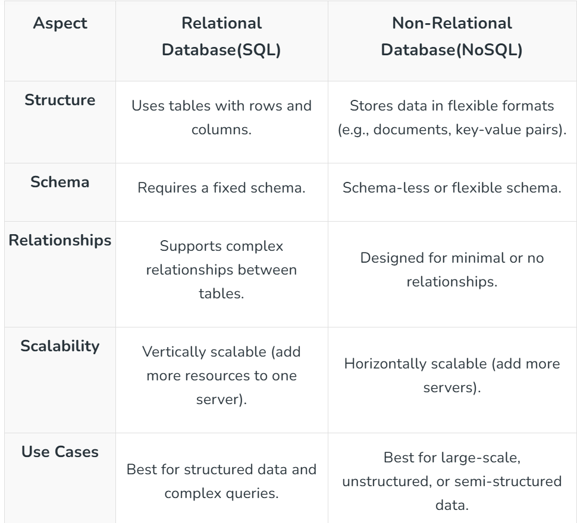

# Database Design

## What is Database Design?

Database design is key to building fast and reliable systems. It involves **organizing data to ensure performance, consistency, and scalability** while meeting application needs. From choosing the right database type to structuring data efficiently, good design plays a crucial role in system success.

---

## What is a Database?

A database is an **organized collection of data** that is stored and managed so that it can be easily accessed, updated, and retrieved when needed. Think of it as a digital filing cabinet where information is systematically arranged to make it easy to find and use.

---

## Key Terminologies

| Term | Description |
|---|---|
| **Data** | Raw and unprocessed statistics |
| **Information** | Data that has been processed — gives an idea of what the data means |
| **DBMS** | Database Management System — a system developed to add, edit, and manage various databases |
| **Transactions** | Any CRUD operation (Create, Read, Update, Delete) performed on a database |

---

## Importance of Database Design

| Benefit | Description |
|---|---|
| **Performance** | A well-designed database processes data quickly — faster responses for users |
| **Scalability** | Can handle more users and data without slowing down as the system grows |
| **Data Integrity** | Prevents duplicate, inconsistent, or incorrect data |
| **Ease of Maintenance** | A clean, logical structure is easier to understand and update |
| **Cost-Efficiency** | Optimized designs use resources efficiently, reducing server costs |
| **Security** | Good design includes measures to protect sensitive data from unauthorized access |

---

## Types of Databases

### Relational Databases (SQL)
- Organize data into tables (rows and columns) with a predefined structure.
- Tables relate to one another using keys (primary and foreign keys).
- **Examples:** MySQL, PostgreSQL, Oracle Database.
- Best for structured data like financial systems or inventory management.

### Non-Relational Databases (NoSQL)
- Do not use tables — store data in flexible formats like documents, key-value pairs, graphs, or columns.
- Designed to handle unstructured or semi-structured data (e.g., social media posts, IoT data).
- **Examples:** MongoDB, Cassandra, DynamoDB.
- Ideal for applications requiring high scalability and flexibility.

---

## How to Select the Right Database

| Factor | SQL | NoSQL |
|---|---|---|
| **Data Structure** | Structured data with complex relationships | Unstructured or semi-structured data |
| **Scalability** | Typically scales vertically | Often scales horizontally |
| **Consistency** | Strong consistency | Can tolerate some inconsistency |
| **Transactions** | Supports ACID properties | Flexible, less strict transaction guarantees |
| **Development Speed** | Stable, predefined schema | Flexible schema — better for rapidly evolving data |

---

## Database Patterns

### 1. Data Sharding
Splitting a large dataset into smaller pieces (shards), each stored on a separate server. Distributes data and workload — improves scalability and performance. Useful when data is too large for a single machine.

### 2. Data Partitioning
Dividing a large dataset into smaller parts (partitions) within the same database or server — by range or list. Improves query performance by limiting the data the system has to process.

### 3. Master-Slave Replication
The master database handles all write operations; slave databases replicate and handle read operations. Offloads read queries from the master and provides redundancy in case of failure.

### 4. CQRS (Command Query Responsibility Segregation)
Separating commands (write operations) from queries (read operations) into two distinct models. Allows optimization of each part for its specific workload.

### 5. Database Normalization
Organizing data to reduce redundancy by splitting data into multiple related tables. Maintains data consistency, reduces storage space, and makes management easier.

### 6. Data Consistency Patterns
Approaches to ensure data across multiple databases or servers remains consistent — especially in distributed systems.

---

## Challenges in Database Design

| Challenge | Solution |
|---|---|
| **Data Redundancy** | Use normalization techniques to reduce redundancy |
| **Scalability** | Use sharding, partitioning, and indexing to distribute and optimize storage |
| **Performance** | Optimize queries, use indexes, consider denormalization where needed |
| **Security** | Use encryption, access controls, and regular security audits |
| **Evolving Requirements** | Use schema evolution, versioning, and keep the schema adaptable |
| **Complex Relationships** | Use normalization and join tables for many-to-many relationships |

---

## Best Practices for Database Design

| Practice | Description |
|---|---|
| **Plan Before You Design** | Understand requirements, gather entities, and define relationships first |
| **Use Normalization** | Reduce redundancy — break large tables into smaller, focused ones |
| **Use Proper Indexing** | Index frequently queried columns; avoid over-indexing as it slows writes |
| **Define Clear Keys** | Always define primary keys; use foreign keys for referential integrity |
| **Optimize for Performance** | Write efficient queries; denormalize where it helps without losing integrity |
| **Consider Data Security** | Encrypt sensitive data; implement access controls; audit regularly |
| **Plan for Scalability** | Use sharding, partitioning, and replication to scale as needed |
