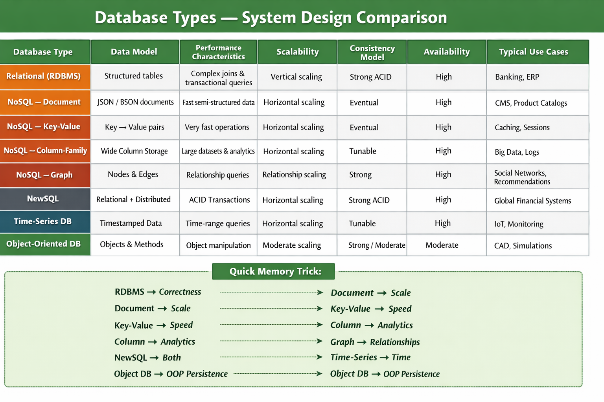

# Types of Databases — When to Choose Which?

## Scenarios and Examples

### 1. Relational Databases (RDBMS)
**Scenario:** An e-commerce platform that needs complex queries, business transactions, and strong consistency.
**Example:** Managing orders, customers, and stock through PostgreSQL.

### 2. NoSQL Document Databases
**Scenario:** A CMS where flexible schema requirements are needed.
**Example:** Storing articles, blog posts, and user-generated content in MongoDB.

### 3. NoSQL Key-Value Stores
**Scenario:** Session storage for a web application where frequent read and write operations are needed.
**Example:** Caching user sessions and configurations in Redis.

### 4. NoSQL Column-Family Stores
**Scenario:** A real-time, high-speed analytics system responsible for processing big data.
**Example:** Applying Cassandra for storing and processing results of user interactive sessions.

### 5. NoSQL Graph Databases
**Scenario:** A social network application that manages connections between people.
**Example:** Handling and storing connections between users through Neo4j.

### 6. NewSQL Databases
**Scenario:** An international financial environment with strict compliance requirements and high scalability needs.
**Example:** Applying Google Spanner to control financial transactions across multiple regions.

### 7. Time-Series Databases
**Scenario:** A system that consumes large amounts of time-series data from various sensors and needs to query it efficiently.
**Example:** Storing temperature and humidity values and analyzing them with InfluxDB.

### 8. Object-Oriented Databases
**Scenario:** A CAD application that deals with multiple large objects and their links.
**Example:** Applying ObjectDB to manage and persist engineering designs and models.

