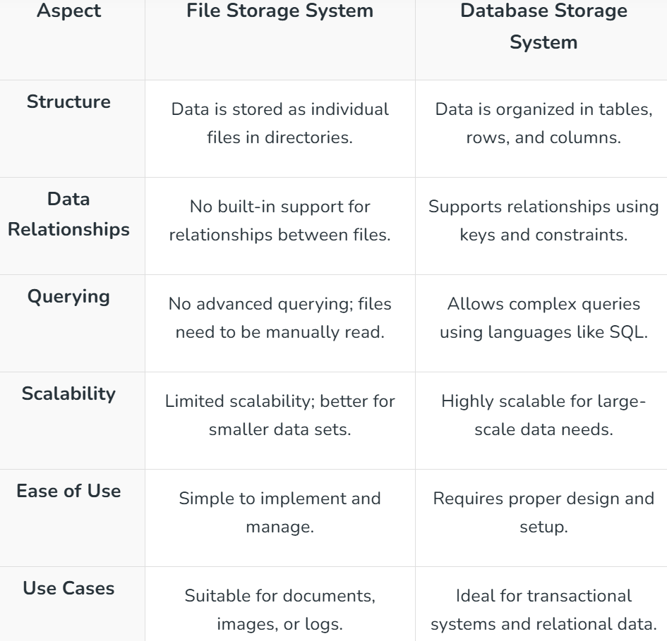

# File-Based Storage vs Database Storage

## 1. File-Based Storage System

On a computer or server, a file-based storage system **keeps data as separate files**. This straightforward approach is effective at storing both organized and unstructured data such as logs, documents, and images. However, it lacks advanced database features like indexing and querying.

### Pros

| Benefit | Description |
|---|---|
| **Simplicity** | Easy to implement and manage, requiring no complex setup |
| **Compatibility** | Works with many standard operating systems and tools |
| **Cost-Effective** | Suitable for small-scale storage needs without high expenses |

### Cons

| Limitation | Description |
|---|---|
| **Limited Scalability** | Not ideal for large-scale systems or growing data needs |
| **No Querying Support** | Cannot perform advanced searches like databases |
| **Data Integrity Issues** | Managing duplicates or relationships between files can be challenging |

---

## 2. Database Storage Systems

A database storage system is a **structured way to store, manage, and retrieve data efficiently**. Unlike file-based systems, databases organize data into tables, rows, and columns, making it easier to query and maintain. Commonly used in applications requiring data relationships, transactions, and large-scale processing.

### Pros

| Benefit | Description |
|---|---|
| **Efficient Querying** | Allows advanced searches and operations using query languages like SQL |
| **Data Integrity** | Maintains consistency and relationships between data |
| **Scalability** | Handles growing data needs with options like sharding or replication |

### Cons

| Limitation | Description |
|---|---|
| **Complex Setup** | Requires proper design and configuration |
| **Higher Cost** | May involve licensing fees and infrastructure expenses |
| **Performance Overhead** | Can be slower than file-based systems for very simple storage needs |

---

