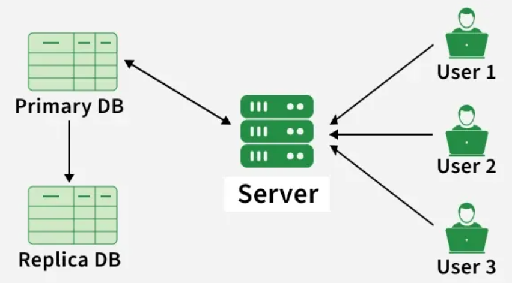

# Database Replication

## What is Database Replication?

Database replication means **creating and maintaining multiple copies of the same database on different servers**. It is used to improve high availability, reliability, scalability, and data accessibility. If one database server fails, another replica can continue serving requests, ensuring the system stays online.

---

## How It Works

| Step | Description |
|---|---|
| **Step 1** | **Identify the Primary Database (Source):** A primary (or master) database is chosen as the main source of truth where data changes originate |
| **Step 2** | **Set Up Replica Databases (Targets):** One or more replicas (or secondary databases) are configured to receive data from the primary |
| **Step 3** | **Data Changes Captured:** Any updates, inserts, or deletes in the primary are recorded through a transaction log or change data capture mechanism |
| **Step 4** | **Transmit Changes to Replicas:** Captured changes are sent to replica databases over the network in real-time or at scheduled intervals |
| **Step 5** | **Apply Changes on Replicas:** The replicas apply these updates to keep their data in sync with the primary database |
| **Step 6** | **Monitor and Maintain Synchronization:** The system ensures replicas stay up-to-date and handles delays or conflicts |
| **Step 7** | **Read or Write Operations:** Applications can read from replicas (to reduce load on the primary) and write to the primary |

---

## Types of Database Replication

### a. Master-Slave Replication
- All write operations (inserts, updates, deletions) go to the master database.
- Slave databases replicate data from the master and handle read operations.

### b. Master-Master (Multi-Master) Replication
- Two or more databases are configured as masters — each can accept write operations.
- Changes made to any master are replicated to all other masters.

### c. Snapshot Replication
- Creates a complete copy of the entire database at a specific point in time and replicates it to destination servers.

### d. Transactional Replication
- Maintains multiple copies synchronized in real-time.
- Any modifications made in the publisher database are instantly copied to subscriber databases.

### e. Merge Replication
- Both the central server (publisher) and connected devices (subscribers) can make changes to the data.
- Conflicts are resolved when necessary.

---

## Replication Strategies

| Strategy | Description |
|---|---|
| **Full Replication** | The entire database is replicated to destination servers — all tables, rows, and columns |
| **Partial Replication** | Only a subset of the database (specific tables, rows, or columns) is replicated |
| **Selective Replication** | Data is replicated based on predefined criteria or conditions — more granular control |
| **Sharding** | Data is partitioned across multiple database instances based on a key — improves scalability and performance |
| **Hybrid Replication** | Combines multiple replication techniques to achieve specific goals |

---

## Importance of Database Replication

| Benefit | Description |
|---|---|
| **High Availability** | Keeps data available even if one server fails — application runs without downtime |
| **Disaster Recovery** | Stores backup copies on multiple servers — helps restore data quickly after failure |
| **Load Balancing** | Allows read requests to be sent to replica servers, reducing load on the primary DB |
| **Fault Tolerance** | Shifts traffic to another replica when one server goes down |
| **Scalability** | Distributes database traffic across servers to handle more users |
| **Data Locality** | Places replicas near users, reducing latency and improving performance |

---

## Challenges with Database Replication

| Challenge | Description |
|---|---|
| **Data Consistency** | Difficult to maintain consistency among replicas — especially with asynchronous replication |
| **Complexity** | Increases system complexity; requires thorough setup and administration |
| **Cost** | Setting up and maintaining a replicated environment can be costly for large-scale deployments |
| **Conflict Resolution** | In multi-master replication, the same data changed on multiple replicas simultaneously requires conflict resolution |
| **Latency** | Synchronous replication requiring acknowledgment before committing can introduce latency |
