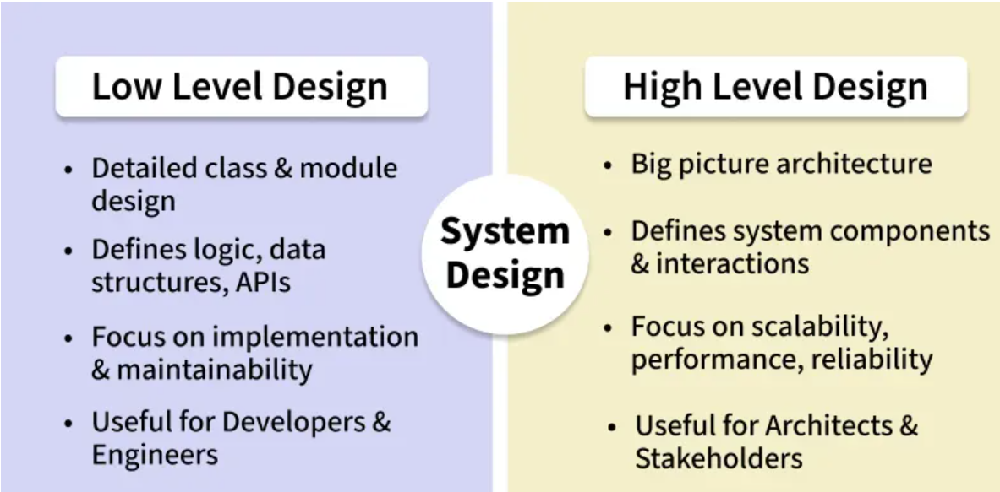

# Introduction to System Design

## What is System Design?

System design is the process of **planning, structuring, and defining the architecture of a software system**. The goal is to create a well-organized and efficient structure that meets the intended purpose while considering factors like scalability, maintainability, and performance.

---

## High Level Design (HLD)

HLD focuses on the **overall architecture** of the system — what components exist, how they interact, and how the system meets non-functional requirements.

**Key points:**
- Communication between components
- Addresses scalability, availability, and fault tolerance
- Target audience: Architects, senior engineers, stakeholders

**Examples:**
- Monolith vs Microservices
- Load balancer + API gateway
- Database sharding & replication
- Cache (Redis), message queues (Kafka)

---

## Low Level Design (LLD)

LLD focuses on the **implementation details** of individual components — how each module is built internally.

**Key points:**
- Class diagrams and object interactions
- Method-level logic
- Data structures and algorithms
- Target audience: Developers and engineers

**Examples:**
- Class design for UserService
- Database schema & indexes
- Exception handling & validations

---

## HLD vs LLD

| Aspect | HLD | LLD |
|---|---|---|
| Focus | Overall architecture | Internal implementation |
| Level | Bird's eye view | Ground-level detail |
| Audience | Architects, stakeholders | Developers, engineers |
| Output | Architecture diagrams | Class diagrams, schemas |

---

## Key Considerations in System Design

| # | Principle | Description |
|---|---|---|
| 1 | **Scalability** | Handle increased load; scale horizontally or vertically |
| 2 | **Performance** | Minimal latency and fast response times |
| 3 | **Reliability** | Minimal downtime and system failures |
| 4 | **Security** | Prevent unauthorized access; protect sensitive data |
| 5 | **Maintainability** | Easy to update with clear documentation and organized code |
| 6 | **Interoperability** | Work seamlessly with other systems via well-defined interfaces |
| 7 | **Usability** | User-friendly and intuitive interface |
| 8 | **Cost-effectiveness** | Minimize development and operational costs |
