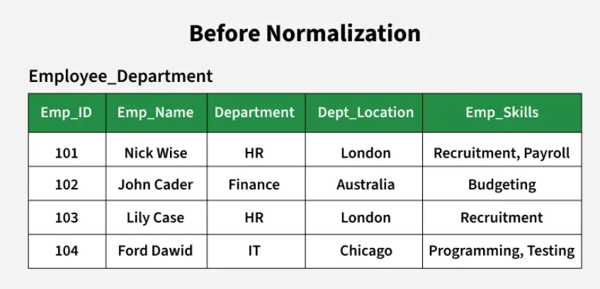

# Normalization in DBMS

## What is Normalization?

Normalization is the process of **organizing the attributes of a database to reduce or eliminate data redundancy** (having the same data in different places). It improves the database's efficiency, consistency, and accuracy, making it easier to manage and maintain.

---

## Problems Without Normalization

Using the `Employee_Department` relation as an example:

| Problem | Description |
|---|---|
| **Insertion Anomaly** | If a new department is created but no employee is assigned yet, we cannot store its location because we need an employee record to insert |
| **Update Anomaly** | If the location of the HR department changes, we must update it in multiple rows — if one row is missed, data becomes inconsistent |
| **Deletion Anomaly** | If all employees in the IT department leave, we lose the department information including its location |
| **Data Redundancy** | The department location is repeated for every employee in the same department |

---

## Benefits of Normalization

1. **Elimination of Data Redundancy** — no duplicate data stored across the database
2. **Ensuring Data Consistency** — updates in one place reflect everywhere
3. **Simplification of Data** — cleaner, more organized structure
