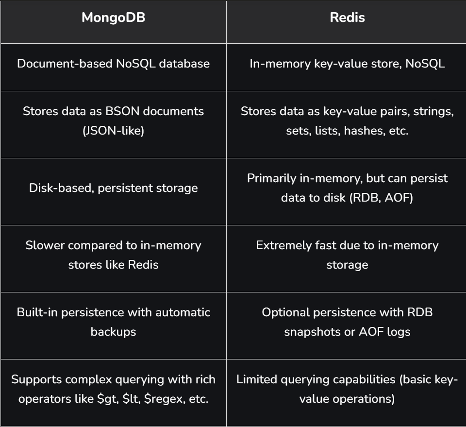
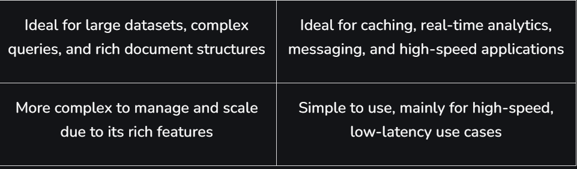

# Redis (Remote Dictionary Server)

## What is Redis?

Redis (Remote Dictionary Server) is an **in-memory database that stores data in RAM instead of disk**, making it extremely fast. It is mainly used to cache frequently accessed data and reduce load on the main database, improving system performance and response time.

- Stores frequently accessed data so applications can retrieve it quickly without querying the main database.
- Used for user sessions, queues, leaderboards, and analytics in applications requiring quick updates.

---

## Real-World Applications

| Company | How They Use Redis |
|---|---|
| **Amazon & Flipkart** | Cache product details, prices, and user sessions — ensuring fast page loads during high traffic sales |
| **Netflix** | Cache frequently accessed content data and manage real-time user sessions for seamless streaming |
| **Facebook & Instagram** | Handle real-time notifications, feeds, and user activity for fast interactions |
| **Uber** | Real-time location tracking, ride matching, and surge pricing calculations |

---

## How Redis Works

Redis acts as a **caching layer between the database and the client** to speed up data access and reduce load on the main database.

| Step | Description |
|---|---|
| **1. Request Handling** | Client sends a request → routed through the API Gateway → checks Redis (cache) first |
| **2. Cache Hit** | Data found in Redis → immediately returned to client, avoiding a DB query |
| **3. Cache Miss** | Data not in Redis → request forwarded to main database |
| **4. Cache Update** | Data fetched from DB → stored in Redis for future use |
| **5. Response to Client** | Final response sent back through the API Gateway (from Redis or DB) |

---

## Factors That Make Redis Fast

| Factor | Description |
|---|---|
| **In-Memory Storage** | All data stored in RAM — read/write operations are much faster than disk-based databases |
| **Single-Threaded Event Loop** | Processes commands using a single-threaded architecture, avoiding multi-thread overhead |
| **Efficient Data Structures** | Uses optimized structures like lists, sets, hashes, and sorted sets for quick operations |
| **Lightweight Protocol** | Uses RESP (Redis Serialization Protocol) — enables fast client-server communication |

---

