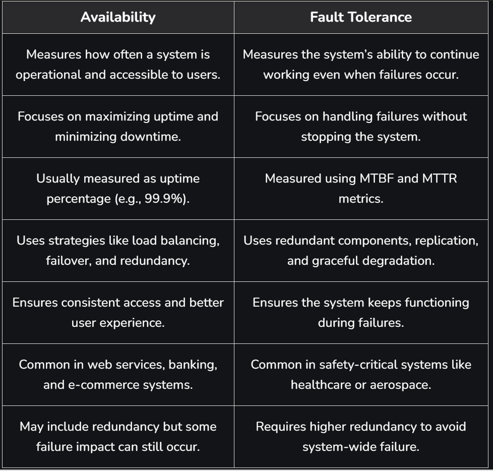

# Availability

## What is Availability?

Availability refers to **how often a system or service is operational and accessible to users** when they need it. It measures the percentage of time a system remains functional without failures or downtime.

- Ensures users can access the system whenever required.
- Keeps services running using backup systems or replicas even if one component fails.
- Recovery mechanisms help restore services quickly after failures, minimizing downtime.

**Example:** Cloud platforms often use multiple servers and data centers so that if one server fails, another can continue serving users without interruption.

---

## Importance of Availability

| Reason | Description |
|---|---|
| **User Experience** | Ensures users can access the system whenever needed — frequent downtime reduces satisfaction |
| **Business Continuity** | Prevents financial loss, reputational damage, and legal issues caused by outages |
| **SLAs** | Organizations commit to specific uptime targets; failure to meet them can lead to penalties |
| **Competitive Advantage** | Higher availability attracts and retains more users, especially in uptime-critical industries |
| **Disaster Recovery** | Supports recovery from hardware issues, network outages, or cyberattacks using redundancy and failover |

---

## Ways to Achieve High Availability

| Method | Description |
|---|---|
| **Redundancy** | Use redundant servers or components so that if one fails, another takes over seamlessly |
| **Load Balancing** | Divides incoming requests among several servers to improve fault tolerance and prevent overload |
| **Failover Mechanisms** | Automated processes that detect failures and switch to redundant systems without manual intervention |
| **Monitoring and Alerting** | Reliable monitoring systems that identify problems instantly and alert administrators |
| **Performance Optimization** | Ensure the system is built to efficiently manage expected load — reduces bottlenecks and breakdowns |
| **Scalability** | Design the system to scale easily by adding more resources when needed |

---

## System Availability vs Asset Reliability

| | System Availability | Asset Reliability |
|---|---|---|
| **Definition** | Percentage of time the entire system is operational and accessible | Ability of individual components to perform without failure |
| **Scope** | Overall system uptime and user accessibility | Performance and failure rate of individual components |
| **Factors** | Network issues, dependencies, failover mechanisms, recovery time | Hardware wear, software bugs, component quality |

**Example:** Even if a single server fails (asset failure), the system can remain available if there are backup servers or redundancy mechanisms in place.

