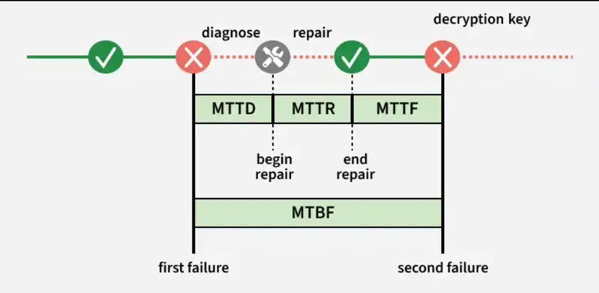

# Measuring High Availability

## Key Metrics

High availability is measured by how reliably a system runs and how quickly it recovers from failures.

### 1. Mean Time Between Failures (MTBF)
Measures the **average time a system runs without failure** — used to estimate reliability trends in repairable systems.

```
MTBF = Total Operational Time / Number of Failures
```

- A higher MTBF indicates fewer failures and better reliability, but does not guarantee failure-free operation.

**Example:** If a server runs for 1,000 hours and fails 5 times → MTBF = 200 hours (the system runs on average 200 hours before a failure).

---

### 2. Mean Time To Repair (MTTR)
Measures the **average time needed to fix a system after a failure** and restore it to normal operation.

```
MTTR = Total Repair Time / Number of Failures
```

- Includes diagnosing the issue, repairing it, testing the system, and confirming everything works.
- A lower MTTR means faster recovery and improved availability.

**Example:** If a server failure takes 2 hours to fix and restore service → MTTR = 2 hours.

---

### Other Related Metrics

| Metric | Description |
|---|---|
| **MTTD** (Mean Time To Detect/Diagnose) | Average time required to detect or identify the cause of a failure |
| **MTTF** (Mean Time To Failure) | Average time a system operates before it fails — used for non-repairable components |



---

## Redundancy Architectures for High Availability

Redundancy ensures high availability by running multiple system instances so that if one fails, another can continue serving users.

### 1. Hot-Cold Architecture
One primary server handles all requests; a backup server remains idle and receives replicated data.

- If the primary server fails, the backup server is **manually activated** to take over.
- **Example:** A banking system where the main database handles all operations while a standby database is kept as a backup.

### 2. Hot-Warm Architecture
The primary server handles both read and write operations; the secondary server assists by handling read requests.

- If the primary fails, the secondary server can **partially take over** and serve traffic.
- **Example:** News websites where users mostly read content and the secondary server helps serve read traffic.

### 3. Hot-Hot Architecture
Multiple servers work as active nodes simultaneously — all nodes handle both read and write operations.

- Requires careful data synchronization between nodes to avoid conflicts.
- **Example:** Session management systems where multiple servers store temporary session data.
