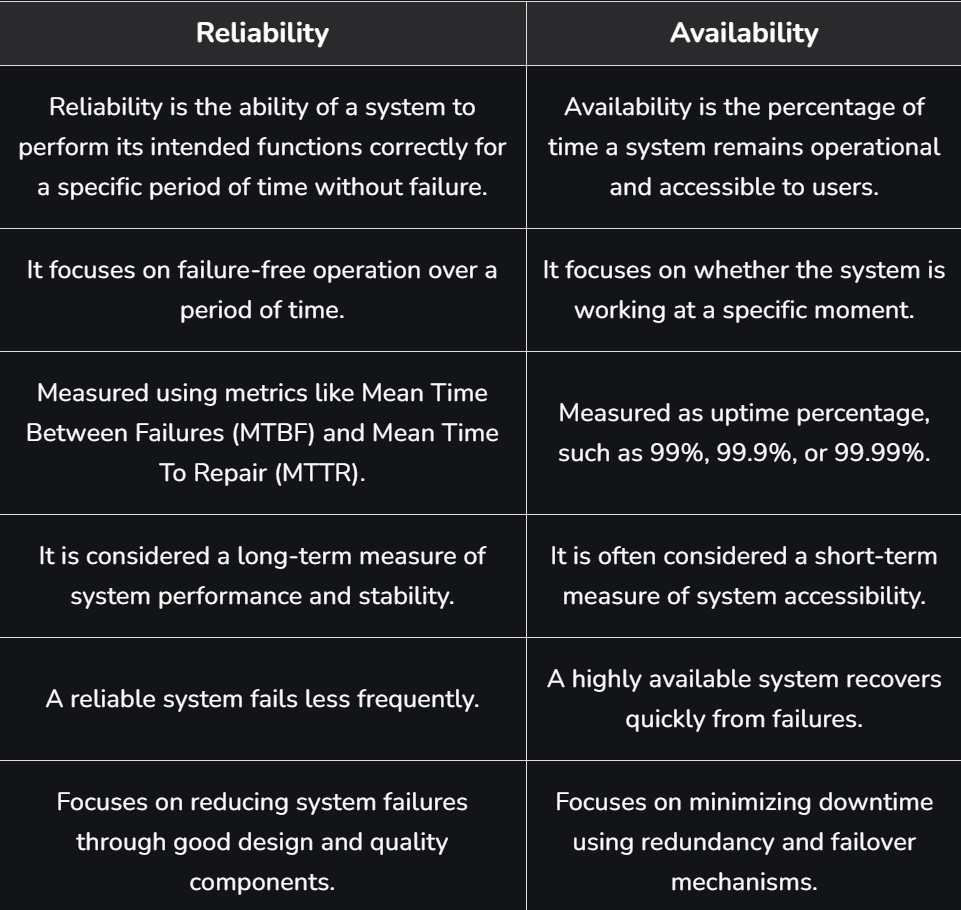
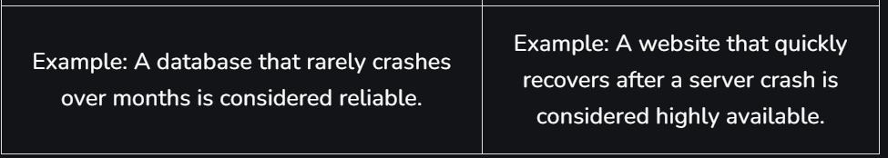

# Reliability

## What is Reliability?

Reliability in system design refers to the **ability of a system to consistently deliver correct and expected performance over time**, even under varying conditions or stress. It focuses on maintaining stable operation and reducing unexpected disruptions.

- A reliable system minimizes downtime, handles errors smoothly, and provides consistent performance to users.

**Example:** In an online banking system, reliability ensures that transactions are processed correctly every time without data loss or system crashes.

---

## Factors That Affect Reliability

| Factor | Description |
|---|---|
| **Design Quality** | Poor system design or lack of proper planning leads to frequent failures and unstable performance |
| **Hardware Quality** | Low-quality components or hardware wear and tear can cause system breakdowns |
| **Software Bugs** | Errors in the code can lead to crashes, incorrect outputs, or unexpected behavior |
| **Maintenance** | Lack of regular updates, monitoring, and testing reduces system reliability |
| **Workload** | Overloading the system beyond its capacity can slow it down or cause failures |
| **External Conditions** | Environmental factors like heat, power failures, or network issues can affect performance |
| **Redundancy** | Without backup systems or failover mechanisms, the system becomes more prone to downtime |

---

## Ways to Improve System Reliability

| Method | Description |
|---|---|
| **Scalability and Maintainability** | Ensures the system continues to work efficiently as it grows and evolves |
| **Fault Tolerance** | Enables the system to detect errors and recover automatically without failure |
| **Load Balancing** | Distributes traffic across systems to avoid overload and handle high demand |
| **Monitoring and Analytics** | Tracks performance and helps detect issues early |
| **Redundancy** | Duplicates critical components so the system keeps running even if one fails |




---

## Ways to Measure Reliability

### 1. Uptime Percentage
Measures the percentage of time a system remains operational during a specific period.

```
Uptime Percentage = ((TotalTime - Downtime) / TotalTime) × 100
```

**Example:** System down for 2 hours in a week (168 hours):
```
Uptime = ((168 - 2) / 168) × 100 = 98.81%
```

### 2. Mean Time Between Failures (MTBF)
Indicates the average time a system operates before experiencing a failure.

```
MTBF = Total Operational Time / Number of Failures
```

**Example:** System runs for 1000 hours and fails 5 times → MTBF = 1000/5 = **200 hours**

### 3. Mean Time to Repair (MTTR)
Measures the average time required to repair a system and restore it to normal operation.

```
MTTR = Total Repair Time / Number of Failures
```

**Example:** System took 10 hours to repair 5 failures → MTTR = 10/5 = **2 hours**

### 4. Error Rate
Shows the percentage of operations or transactions that result in errors.

```
Error Rate = (Number of Errors / Total Transactions) × 100
```

**Example:** 50 errors in 10,000 operations → Error Rate = (50/10000) × 100 = **0.5%**

---

## Reasons for System Failures

| Reason | Description |
|---|---|
| **Poor System Design** | Inadequate architecture or lack of proper planning leads to unstable systems |
| **Hardware Failures** | Physical components (servers, disks, network devices) may fail due to wear and tear |
| **Software Bugs** | Errors in application code or configuration cause crashes or incorrect behavior |
| **Overloaded Systems** | Handling more traffic than designed for causes performance degradation or service failure |
| **Network Issues** | Slow or unstable connections interrupt communication between system components |
| **Lack of Monitoring** | Without proper monitoring and maintenance, small issues grow into major failures |
| **Single Point of Failure (SPOF)** | If a critical component fails with no backup, the entire system may stop functioning |

---

## Ways to Avoid Single Point of Failure (SPOF)

| Strategy | Description |
|---|---|
| **Redundancy** | Duplicate critical components so backup systems can take over if one fails |
| **Load Balancing** | Distribute workloads across multiple servers to prevent overloading a single component |
| **Failover Mechanisms** | Automatically switch to backup systems when the primary system fails |
| **Regular Testing** | Conduct stress testing and failure simulations to detect weaknesses early |
| **Monitoring and Alerts** | Continuously monitor system health and receive alerts when issues occur |
| **Proper Documentation** | Maintain clear documentation to help engineers quickly troubleshoot and resolve problems |
| **Continuous Improvement** | Regularly update and improve system architecture using best practices |
