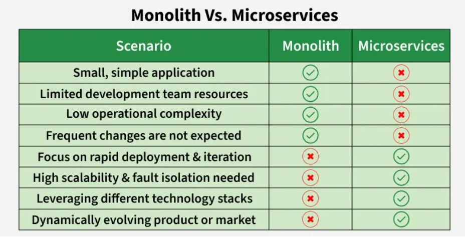

# Microservices Architecture

## What is Microservices Architecture?

Microservices is an architectural approach where software is developed as a **collection of small, independent services that communicate over a network**.

- Instead of a monolithic codebase, the application is broken into smaller, loosely coupled services.
- Services can be written in different programming languages and frameworks — each acts as a mini-application on its own.
- Each microservice is designed to perform a specific business function and can be developed, deployed, and scaled **independently**.
- Microservices can be updated independently, reducing risks during changes and enhancing system resilience.

---

## Benefits of Microservices Architecture

| Benefit | Description |
|---|---|
| **Parallel Development** | Teams can work on different microservices simultaneously |
| **Fault Isolation** | Issues in one service do not impact others, enhancing reliability |
| **Independent Scaling** | Each service can be scaled based on its specific needs |
| **Flexibility** | The system can quickly adapt to changing workloads |
| **Technology Freedom** | Teams can choose the best tech stack for each microservice |
| **Team Autonomy** | Small, cross-functional teams work independently |

---

## Challenges of Microservices Architecture

| Challenge | Description |
|---|---|
| **Distributed Complexity** | Managing service communication, network latency, and data consistency can be difficult |
| **Development Overhead** | Decomposing an app into microservices adds complexity in development, testing, and deployment |
| **Network Latency** | Network communication can lead to higher latency and complicates error handling |
| **Data Consistency** | Maintaining consistent data across services is challenging; distributed transactions can be complex |

---

