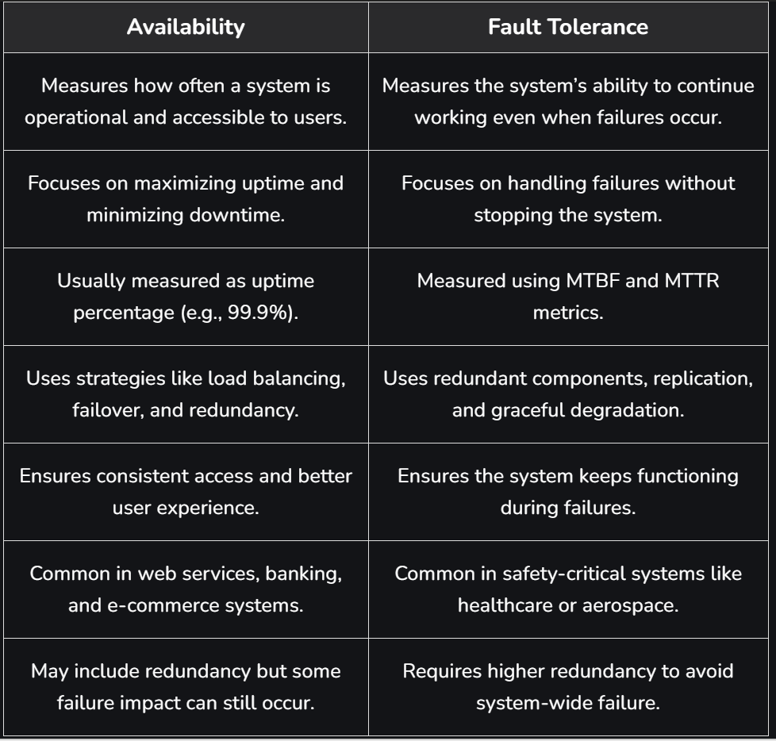

Availability refers to how often a system or service is operational and accessible to users when they need it. It measures the percentage of time a system remains functional without failures or downtime.

Ensures users can access the system whenever required and keeps services running using backup systems or replicas even if one component fails.

Recovery mechanisms help restore services quickly after failures, maintaining availability and minimizing downtime.

Example: Cloud platforms often use multiple servers and data centers so that if one server fails, another can continue serving users without interruption.

Importance
Availability is important because it ensures that systems and services remain accessible and reliable for users and businesses.

1: User Experience: Availability ensures users can access the system and its services whenever needed. Frequent downtime can frustrate users and reduce overall satisfaction.

2: Business Continuity: High availability helps maintain continuous operations and prevents financial loss, reputational damage, and legal issues caused by system outages.

3: Service Level Agreements (SLAs): Organizations commit to specific uptime targets through SLAs, and failure to meet them can lead to penalties or contractual consequences.

4: Competitive Advantage: Systems with higher availability are more reliable and can attract and retain more users, especially in industries where uptime is critical.

5: Disaster Recovery: Availability supports recovery from failures like hardware issues, network outages, or cyberattacks using redundancy and failover mechanisms.

Ways to Achieve High Availability
High availability is essential for systems that must run continuously, as downtime can lead to financial loss, reputational damage, or safety risks, especially in critical domains like cloud, healthcare, banking, and e-commerce.

1: Redundancy: Use redundant servers or components so that, in the event of a failure, another can take over without any problems. Data centers, networking, and hardware redundancy are a few examples of this.

2: Load balancing: Incoming requests are divided among several servers or resources to enhance system performance and fault tolerance while avoiding overload on any one part.

3: Failover mechanisms: Implementing automated processes to detect failures and switch to redundant systems without manual intervention.

4: Monitoring and Alerting: Putting in place reliable monitoring systems that can identify problems instantly and alert administrators so they can act quickly.

5: Performance optimization: lowering the possibility of bottlenecks and breakdowns by making sure the system is built and adjusted to efficiently manage the expected load.

6: Scalability: Designing the system to scale easily by adding more resources when needed to accommodate increased demand.

System Availability Vs Asset Reliability
System availability and asset reliability are related concepts in system design, but they focus on different aspects of system performance and stability.

System Availability
Refers to the percentage of time the entire system is operational and accessible to users. It considers factors such as network issues, dependencies, failover mechanisms, and recovery time, not just component reliability.

Asset Reliability
Refers to the ability of individual components (such as servers, databases, or hardware) to perform their tasks without failure. Higher reliability of individual assets reduces the chances of system failures.

Difference
System Availability focuses on the overall system uptime and user accessibility.
Asset Reliability focuses on the performance and failure rate of individual components within the system.
Example: Even if a single server fails (asset failure), the system can still remain available if there are backup servers or redundancy mechanisms in place.

