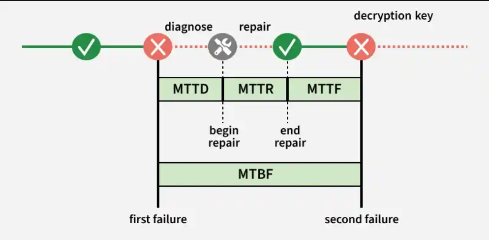

Methods to Measure High Availability
High availability is measured by how reliably a system runs and how quickly it recovers from failures. Key metrics like MTBF and MTTR are used to evaluate system reliability and downtime.

1. Mean Time Between Failures (MTBF)
MTBF (Mean Time Between Failures) measures the average time a system runs without failure and is used to estimate reliability trends in repairable systems.

It is calculated as total operational time divided by the number of failures, helping track system performance over time.
A higher MTBF indicates fewer failures and better system reliability, but it does not guarantee failure-free operation.
Example: If a server runs for 1,000 hours and fails 5 times, the MTBF would be 200 hours, meaning the system runs on average for 200 hours before a failure occurs.

2. Mean Time To Repair (MTTR)
MTTR (Mean Time To Repair) measures the average time needed to fix a system after a failure and restore it to normal operation.

It includes diagnosing the issue, repairing it, testing the system, and confirming everything works correctly.
A lower MTTR means faster recovery, leading to improved system availability and reliability.
Example: If a server failure takes 2 hours to fix and restore service, the MTTR for that incident is 2 hours.

Other Related Metrics
There are a few additional metrics often used when analyzing system availability:

1: MTTD (Mean Time To Detect/Diagnose): The average time required to detect or identify the cause of a failure.

2: MTTF (Mean Time To Failure): The average time a system or component operates before it fails, usually used for non-repairable components.

Redundancy Architectures for High Availability
Redundancy ensures high availability by running multiple system instances so that if one fails, another can continue serving users. It is often combined with data replication to keep data copies across multiple servers for reliability.

1. Hot - Cold Architecture
In this architecture, one server acts as the primary while another server remains as a backup to take over if the primary fails.

One primary server handles all requests, while a backup server remains idle and receives replicated data.
If the primary server fails, the backup server is manually activated to take over operations.

Example: A banking system where the main database handles all operations while a standby database is kept as a backup.

2. Hot - Warm Architecture
This architecture allows the secondary server to handle some workload, usually read operations, to utilize resources better.

The primary server handles both read and write operations, while the secondary server assists by handling read requests.
If the primary fails, the secondary server can partially take over and serve traffic.

Example: News websites where users mostly read content and the secondary server helps serve read traffic.

3. Hot - Hot Architecture
In this setup, multiple servers work as active nodes and can handle requests simultaneously.

Multiple servers act as active primary nodes, and all nodes can handle both read and write operations.
Requires careful data synchronization between nodes to avoid conflicts.

Example: Session management systems where multiple servers store temporary session data.