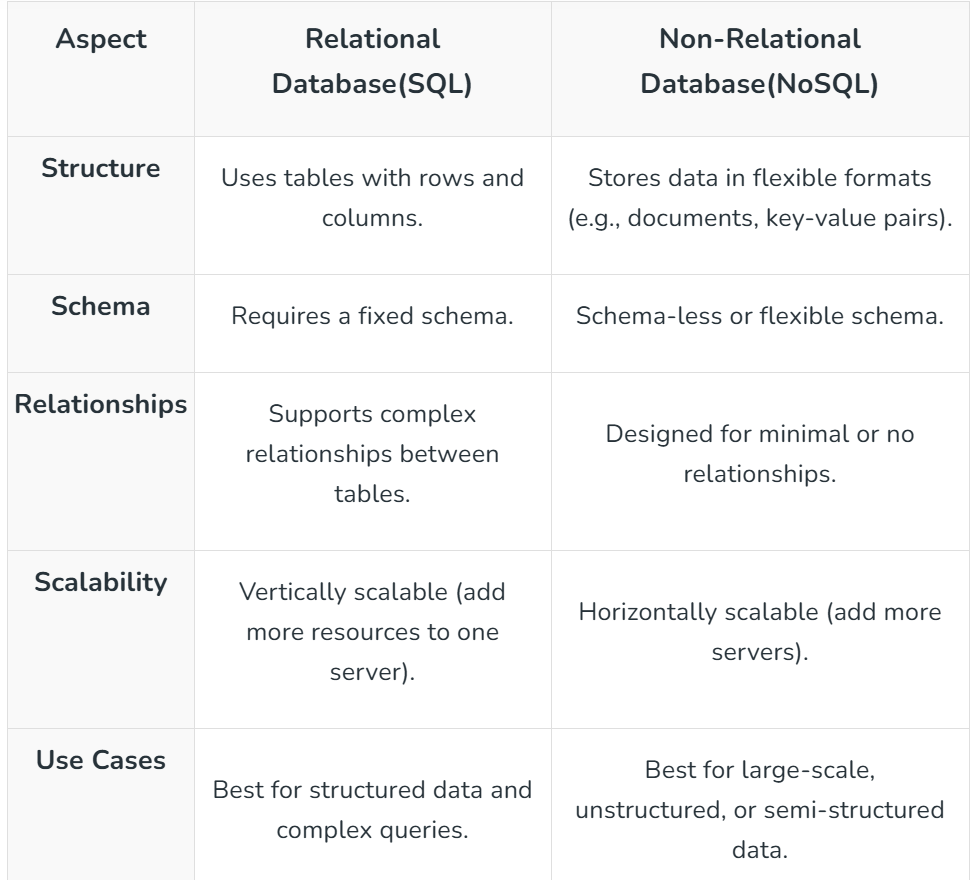

1: Database design is key to building fast and reliable systems. It involves organizing data to ensure performance, consistency, and scalability while meeting application needs. From choosing the right database type to structuring data efficiently, good design plays a crucial role in system success. This guide covers the basics, types, models, and advanced concepts of database design, providing you with a clear path to mastering this essential part of system architecture.

2: What is a Database?
    A database is an organized collection of data that is stored and managed so that it can be easily accessed, updated, and retrieved when needed.
    A database helps store large amounts of data in a structured and efficient way. It’s used in various applications, from websites and mobile apps to enterprise systems. Think of it as a digital filing cabinet where information is systematically arranged to make it easy to find and use.

3: Terminologies used in the Database:

a:  Data: Any statistics which is raw and unprocessed are referred as Data.
b:  Information: When data is processed, it is known as Information. This is because information gives an idea about what the data is   about and how to use it further
c:  Database Management System(DBMS): A system developed to add, edit, and manage various databases in a collection is known as DBMS.
d:  Transactions: Any CRUD operation performed on a database is called a Transaction in the Database.

4: Importance of Database Design in System Design
Good database design is important in system design because it ensures that the system can handle data efficiently, reliably, and at scale. Let us see its importance:

a:  Performance: A well-designed database processes data quickly, which means faster responses for users and smoother system operations.
b:  Scalability: As the system grows, a good database design can handle more users and data without slowing down or failing.
c:  Data Integrity: Proper design prevents duplicate, inconsistent, or incorrect data, ensuring the system works accurately.
d:  Ease of Maintenance: A clean, logical database structure is easier to understand and update, saving time and effort when making changes or fixing issues.
d:  Cost-Efficiency: Optimized database designs use resources efficiently, reducing server costs and improving overall system performance.
e:  Security: Good design includes measures to protect sensitive data from unauthorized access.

5: Types of Databases
a:   Relational Databases(SQL)
    Organize data into tables (rows and columns), where each table has a predefined structure.
    Tables can have relationships with one another using keys (e.g., primary and foreign keys).
    Example: MySQL, PostgreSQL, and Oracle Database.
    Best for structured data like financial systems or inventory management.
b:   Non-Relational Databases(NoSQL)
    Do not use tables. Instead, they store data in flexible formats like documents, key-value pairs, graphs, or columns.
    Designed to handle unstructured or semi-structured data, such as social media posts or IoT data.
    Example: MongoDB, Cassandra, and DynamoDB.
    Ideal for applications that require high scalability and flexibility.

    