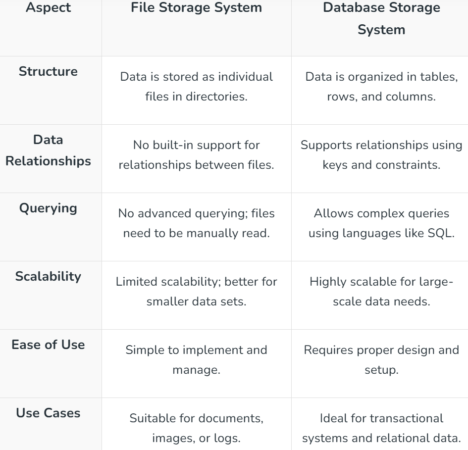

1:  File-based storage system in System Design:

On a computer or server, a file-based storage system keeps data as separate files. This straightforward approach is effective at storing both organized and unstructured data, such as logs, papers, and photos. But it doesn't have advanced functions of databases, including indexing and querying.

Pros of File-based storage system:

a: Simplicity: Easy to implement and manage, requiring no complex setup.
b: Compatibility: Works with many standard operating systems and tools.
c: Cost-Effective: Suitable for small-scale storage needs without high expenses.

Cons of File-based storage system:

a: Limited Scalability: Not ideal for large-scale systems or growing data needs.
b: No Querying Support: Cannot perform advanced searches like databases.
c: Data Integrity Issues: Managing duplicates or relationships between files can be challenging.

2:  Database Storage Systems in System Design
A database storage system is a structured way to store, manage, and retrieve data efficiently. Unlike file-based systems, databases organize data into tables, rows, and columns, making it easier to query and maintain. These systems are commonly used in applications requiring data relationships, transactions, and large-scale processing.

Pros of Database Storage Systems:

a: Efficient Querying: Allows advanced searches and operations using query languages like SQL.
b: Data Integrity: Maintains consistency and relationships between data.
c: Scalability: Handles growing data needs with options like sharding or replication.

Cons of Database Storage Systems:

a: Complex Setup: Requires proper design and configuration.
b: Higher Cost: May involve licensing fees and infrastructure expenses.
c: Performance Overhead: Can be slower for very simple data storage needs compared to file-based systems.

