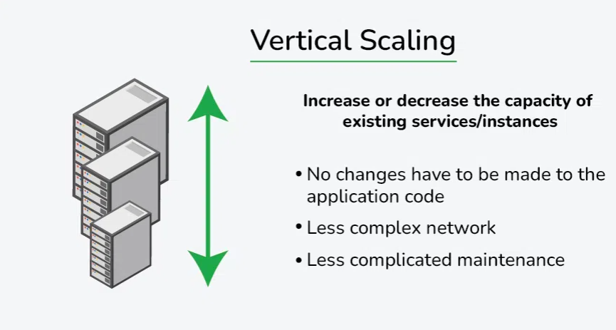
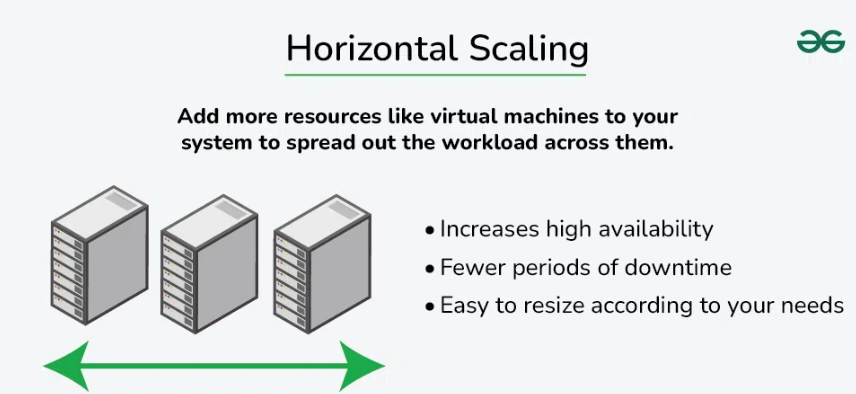

1: Vertical Scaling
    Vertical scaling, also known as scaling up, refers to the process of increasing the capacity or capabilities of an individual hardware or software component within a system.

    We upgrade the same system rather than adding more systems. Add more power to your machine by adding better processors, increasing RAM, or other power-increasing adjustments.
    Simple to implement and useful for monolithic and small scale applications.

    

Vertical scaling also known as Scaling Up.

Examples
Upgrading a MySQL server from 16 GB RAM to 64 GB to handle more queries.
Moving a website hosted on a 2-core VM to an 8-core, higher-RAM VM to improve performance.
E-commerce platform running on a single large AWS EC2 instance with increased resources (CPU, RAM, disk).

Advantages: 

Increased capacity: A server's performance and ability to manage incoming requests can both be enhanced by upgrading its hardware.
Easier management: Upgrading a single node is usually the focus of vertical scaling, which might be simpler than maintaining several nodes.
Disadvantages: 

Limited scalability: Vertical scaling is constrained by the hardware's physical limitations. Horizontal Scaling is not limited.
One server still receives all incoming requests thus increasing the possibility of downtime in the event of a server failure.
Scaling up often requires restarting or replacing the machine, causing downtime.    

2: Horizontal Scaling
    Horizontal scaling, also known as scaling out, refers to the process of increasing the capacity or performance of a system by adding more machines or servers to distribute the workload across a larger number of individual units.

    There is no need to change the capacity of the server or replace the server.
    There is no downtime while adding more servers to the network.

    

Examples:

A website like GeeksforGeeks adds more web servers behind a load balancer to handle traffic spikes.
Netflix scales different microservices independently — e.g., multiple instances of the streaming service across regions.
Amazon Auto Scaling spins up more EC2 instances during peak shopping hours (e.g., Black Friday).
Akamai or Cloudflare uses servers distributed globally to serve content closer to users.

Advantages:

Increased capacity: More nodes or instances can handle a larger number of incoming requests.
Improved performance: By distributing the load over several nodes or instances, it is less likely that any one server will get overloaded.
Increased fault tolerance: Incoming requests can be sent to another node in the event of a node failure, lowering the possibility of downtime.

Disadvantages: 

Requires complex architecture (load balancers, distributed databases, etc.).
Difficult to maintain strong consistency across distributed nodes. Requires synchronization, messaging, or replication between nodes.
More machines = more networking, power, and maintenance.
Needs orchestration tools (e.g., Kubernetes, Ansible) to manage many servers.
Issues can be spread across nodes, making root-cause analysis tricky.
Communication between nodes adds latency and complexity.    

3: | **Aspect**                    | **Horizontal Scaling (Scale-Out)**            | **Vertical Scaling (Scale-Up)** 
| ----------------------------- | ------------------------------------------------------------------------------------- | ----------------------------------------------------------------------------------- |
| **Definition**                | Adds more machines/servers to distribute workload. | Enhances resources (CPU, RAM, storage) of an existing machine. 
| **Resource Addition**         | New servers or instances. | More resources to one server.
| **Scalability Limits**        | Virtually unlimited (can keep adding nodes). | Limited by hardware maximums.
| **Cost**                      | Higher initial infrastructure cost (more machines). | Lower initial cost (only upgrading one machine).
| **Fault Tolerance**           | High — if one node fails, others take over. | Low — single node failure affects whole system.
| **Performance**               | Can increase almost linearly with nodes. | Improves up to hardware capacity; then plateaus.
| **Complexity**               | More complex: requires load balancers, distributed coordination.| Simpler: single node, easier to manage.
| **Downtime for Scaling**      | Usually minimal or none.  | Can require downtime to upgrade hardware.
| **Load Balancing**            | Required to distribute across nodes. | Not generally required for single node.
| **Use Cases / Applicability** | Best for large systems, cloud-native, high traffic.  | Suitable for moderate loads, small systems.
| **Maintenance / Management**  | Need orchestration (e.g., Kubernetes).                        | Easier — fewer components. 