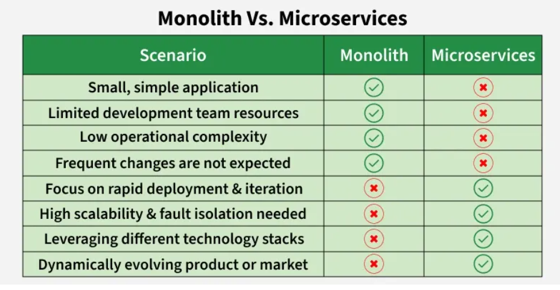

1: Microservices are an architectural approach to developing software applications as a collection of small, independent services that communicate with each other over a network.
a: Instead of building a monolithic application where all the functionality is tightly integrated into a single codebase, microservices break down the application into smaller, loosely coupled services.
b: Can be written in a variety of programming languages, and frameworks, and each service acts as a mini-application on its own.
c: A small, loosely coupled service that is designed to perform a specific business function and each microservice can be developed, deployed, and scaled independently.
d: Microservices can be updated independently, reducing risks during changes and enhancing system resilience.

2: Benefits of Using Microservices Architecture
a: Teams can work on different microservices simultaneously.
b: Issues in one service do not impact others, enhancing reliability.
c: Each service can be scaled based on its specific needs.
d: The system can quickly adapt to changing workload s.
e: Teams can choose the best tech stack for each microservice.
f: Small, cross-functional teams work independently.

3: Challenges of Using Microservices Architecture
a: Managing service communication, network latency, and data consistency can be difficult.
b: Decomposing an app into microservices adds complexity in development, testing and deployment.
c: Network communication can lead to higher latency and complicates error handling.
d: Maintaining consistent data across services is challenging, and distributed transactions can be  complex.

