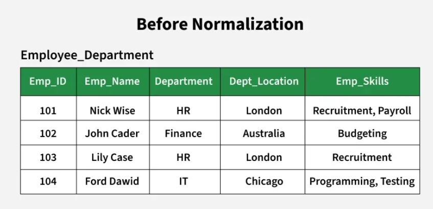

Normalization is an important process in database design that helps improve the database's efficiency, consistency, and accuracy. It makes it easier to manage and maintain the data and ensures that the database is adaptable to changing business needs.

Database normalisation is the process of organizing the attributes of the database to reduce or eliminate data redundancy (having the same data but at different places).

Problems in the Employee_Department Relation

Insertion Anomaly: If a new department is created but no employee is assigned to it yet, we cannot store its location because we need an employee record to insert.

Update Anomaly: If the location of the HR department changes, we must update it in multiple rows (for both Nick Wise and Lily Case). If one row is missed, the data becomes inconsistent.

Deletion Anomaly: If all employees in the IT department leave, we lose the department information, including its location.

Data Redundancy: The department location is repeated for every employee in the same department.

Benefits:
1: Elimination of Data Redundancy
2: Ensuring Data Consistency
3: Simplification of Data.