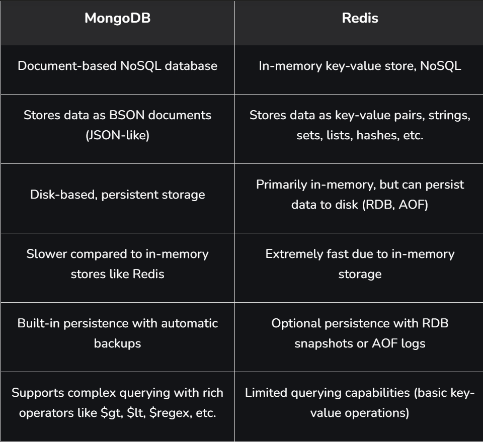
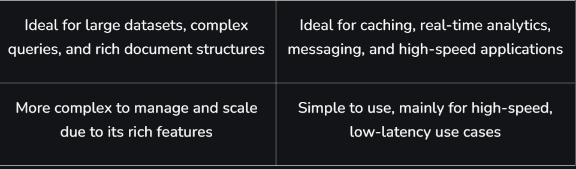

Redis (Remote Dictionary Server) is an in-memory database that stores data in RAM instead of disk, making it extremely fast. It is mainly used to cache frequently used data and reduce the load on the main database, which improves system performance and response time.

Stores frequently accessed data so applications can retrieve it quickly without querying the main database, improving performance and response time.
Used to store user sessions for fast authentication and helps manage queues, leaderboards, and analytics in applications requiring quick updates.

Real-World Applications:

Redis is widely used by large-scale applications to handle high-speed data access, real-time processing, and efficient caching.

1: Amazon & Flipkart: Use Redis to cache product details, prices, and user sessions, ensuring fast page loads and smooth checkout during high traffic sales.

2: Netflix: Uses Redis for caching frequently accessed content data and managing real-time user sessions to deliver a seamless streaming experience.

3: Facebook & Instagram: Use Redis to handle real-time notifications, feeds, and user activity for fast and responsive interactions.

4: Uber: Uses Redis for real-time location tracking, ride matching, and surge pricing calculations.

Working
Redis acts as a caching layer between the database and the client to speed up data access and reduce the load on the main database. When a client asks for data, the API Gateway forwards the request to Redis.

1. Request Handling
When a client sends a request, it is first routed through the API Gateway. The API Gateway checks Redis (cache) to see if the requested data is already available.

2. Cache Hit
If the data is found in Redis, it is immediately returned to the client. This avoids querying the main database and significantly improves response time.

3. Cache Miss
If the data is not present in Redis, the request is forwarded to the main database. The database processes the request and returns the required data to the application.

4. Cache Update
After fetching data from the database, it is stored in Redis for future use. This ensures that subsequent requests for the same data can be served faster.

5. Response to Client
The final response is sent back to the client through the API Gateway. The data may come from either Redis (cache) or the main database depending on availability.

Factors That Make Redis Fast: 

Redis is extremely fast because it stores data in memory (RAM) instead of reading from disk storage. Accessing data from memory is much quicker, which allows Redis to process requests with very low latency.

1: In-Memory Storage: All data is stored in RAM, so read and write operations are much faster than disk-based databases.

2: Single-Threaded Event Loop: Redis processes commands using a single-threaded architecture, which avoids the overhead of managing multiple threads and context switching.

3: Efficient Data Structures: Redis uses optimized data structures like lists, sets, hashes, and sorted sets for quick data operations.

4: Lightweight Communication Protocol: It uses a simple protocol called RESP (Redis Serialization Protocol) that enables fast communication between the client and the server.

