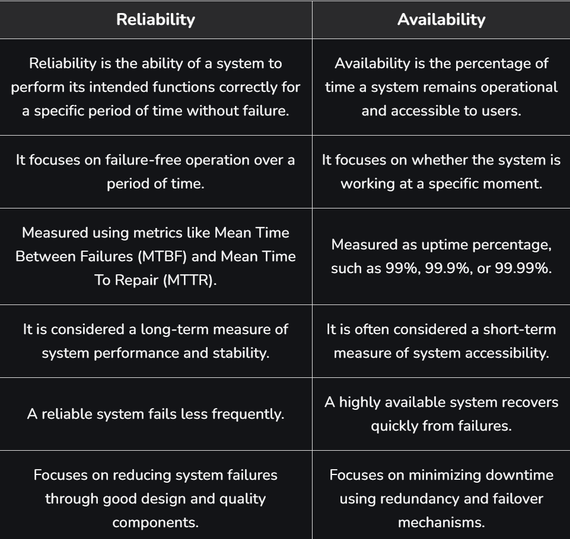
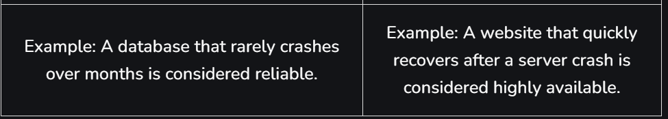

Reliability in system design refers to the ability of a system to consistently deliver correct and expected performance over time, even under varying conditions or stress. It focuses on maintaining stable operation and reducing unexpected disruptions.

System reliability refers to how consistently a system performs its intended functions without failure over a given period under specified operating conditions.

It means the system can be trusted to work correctly, even under stress or in different conditions.

A reliable system minimizes downtime, handles errors smoothly, and provides consistent performance to users.

 Example: In an online banking system, reliability ensures that transactions are processed correctly every time without data loss or system crashes.

 Factors That Affect Reliability
Several factors influence the reliability of a system. These factors determine how consistently a system can perform without failures.

1: Design Quality: Poor system design or lack of proper planning can lead to frequent failures and unstable performance.

2: Hardware Quality: Low-quality components or hardware wear and tear can cause system breakdowns.

3: Software Bugs: Errors in the code can lead to crashes, incorrect outputs, or unexpected behavior.

4: Maintenance: Lack of regular updates, monitoring, and testing can reduce system reliability.

5: Workload: Overloading the system beyond its capacity can slow it down or cause failures.

6: External Conditions: Environmental factors like heat, power failures, or network issues can affect performance.

7: Redundancy: Without backup systems or failover mechanisms, the system becomes more prone to downtime.

Ways to Improve System Reliability
These approaches help systems remain stable, reduce failures, and maintain consistent performance under different conditions.

1: Scalability and Maintainability: It ensure the system continues to work efficiently as it grows and evolves over time.

2: Fault Tolerance: It enables the system to detect errors and recover automatically without failure.

3: Load Balancing: It is used to distributes traffic across systems to avoid overload and handle high demand smoothly.

4: Monitoring and Analytics: Monitoring and analytics track performance and help detect issues early.

5: Redundancy: Remove duplicates critical components so the system keeps running even if one fails.

Ways to Measure Reliability
Here’s how reliability can be measured with formulas for better clarity:

1. Uptime Percentage
This metric measures the percentage of time a system remains operational during a specific period.

Uptime Percentage = ((TotalTime-Downtime) / TotalTime ) * 100

Example: If a system was down for 2 hours in a week (168 hours), uptime will be:

Uptime = ((168-2)/168) * 100 = 98.81%

2. Mean Time Between Failures (MTBF)
MTBF indicates the average time a system operates before experiencing a failure.

MTBF = (Total Operational Time / Number of Failures)

Example: If a system runs for 1000 hours and fails 5 times, MTBF will be:

MTBF =  (1000/5) = 200 hours

3. Mean Time to Repair (MTTR)
MTTR measures the average time required to repair a system and restore it to normal operation after a failure.

MTTR = Total Repair Time / Number of Failures

​Example: If the system took 10 hours to repair 5 failures, MTTR will be:

MTTR = 10/5 = 2 hours

4. Error Rate
Error rate shows the percentage of operations or transactions that result in errors.

Error Rate = (Number of Errors / Total Transactions or Operations) * 100

Example: If there are 50 errors in 10,000 operations , Error rate will be:

Error Rate = (50/10000) × 100 = 0.5%.

Reasons for System Failures
Systems can become unreliable when they experience frequent failures, poor performance, or unexpected disruptions. These issues often arise due to design flaws, resource limitations, or external factors affecting system stability.

1: Poor System Design: Inadequate architecture or lack of proper planning can lead to unstable systems and frequent failures.

2: Hardware Failures: Physical components such as servers, disks, or network devices may fail over time due to wear and tear.

3: Software Bugs: Errors in the application code or configuration can cause crashes, incorrect outputs, or unexpected behavior.

4: Overloaded Systems: When systems handle more traffic or workload than they are designed for, performance may degrade or services may fail.

5: Network Issues: Slow or unstable network connections can interrupt communication between system components.

6: Lack of Monitoring and Maintenance: Without proper monitoring, updates, and regular maintenance, small issues can grow into major system failures.

7:Single Point of Failure (SPOF): If a critical component fails and no backup is available, the entire system may stop functioning.

Ways to Avoid Single Point of Failure (SPOF)
Avoiding single points of failure is important for building reliable and resilient systems. The following strategies can help eliminate SPOFs:

1: Redundancy: Duplicate critical components so that backup systems can take over if one component fails.

2: Load Balancing: Distribute workloads across multiple servers to prevent overloading a single component.

3: Failover Mechanisms: Automatically switch to backup systems when the primary system fails.

4: Regular Testing: Conduct stress testing and failure simulations to detect weaknesses early.

5: Monitoring and Alerts: Continuously monitor system health and receive alerts when issues occur.

6: Proper Documentation: Maintain clear documentation to help engineers quickly troubleshoot and resolve problems.

7: Continuous Improvement: Regularly update and improve system architecture using best practices.