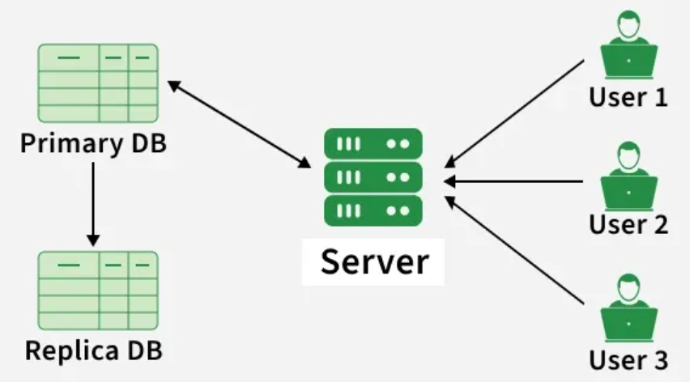

Database replication in system design means creating and maintaining multiple copies of the same database on different servers. It is used to improve high availability, reliability, scalability, and data accessibility. If one database server fails, another replica can continue serving requests, ensuring the system stays online.

[Step 1]: Identify the Primary Database (Source): A primary (or master) database is chosen as the main source of truth where data changes originate.
[Step 2]: Set Up Replica Databases (Targets): One or more replicas (or secondary databases) are configured to receive data from the primary database.
[Step 3]: Data Changes Captured: Any updates, inserts, or deletes in the primary database are recorded, typically through a transaction log or change data capture mechanism.
[Step 4]: Transmit Changes to Replicas: The captured changes are sent to replica databases over the network in real-time or at scheduled intervals.
[Step 5]: Apply Changes on Replicas: The replicas apply these updates to keep their data in sync with the primary database.
[Step 6]: Monitor and Maintain Synchronization: The system ensures replicas stay up-to-date and handles issues like delays or conflicts during synchronization.
[Step 7]: Read or Write Operations: Applications can read data from replicas (to reduce load on the primary) and may write to the primary, depending on the replication model (e.g., Master-Slave, Master-Master).

3:  Type of Database Replications:
a: Master-Slave Replication:

The process of copying and synchronizing data from a primary database (the master) to one or more secondary databases (the slaves) is known as master-slave replication.
In this configuration, all write operations, including inserts, updates, and deletions, must be received by the master database.
The slave databases keep a duplicate of the data and replicate the modifications made to the master database.

b: Master-Master Replication/Multi-Master Replication:

Master-master replication, also known as bidirectional replication, is a setup in which two or more databases are configured as master databases, and each master can accept write operations.
This means that changes made to any master database are replicated to all other master databases in the configuration.

c: Snapshot Replication:

Creating a copy of the whole database at a certain moment in time and then replicating that snapshot to one or more destination servers is known as snapshot replication.

d: Transactional Replication:

One way to maintain several copies of a database synchronized in real-time is through transactional replication.
This means any modifications made to a particular table (or group of tables) in one database—referred to as the publisher—are instantly copied to other databases—referred to as subscribers.

e:  Merge Replication:

Merge replication is a database synchronization method allowing both the central server (publisher) and its connected devices (subscribers) to make changes to the data, resolving conflicts when necessary.

4:  Strategies for Database Replication
Database replication strategies determine how to select data, copy and distribute it between databases to gain specific goals such as scalability, availability, and efficiency.

Some common database replication strategies include the following:

a: Full Replication: Also referred to as full database replication, this is a technique in which the whole database is replicated to one or more destination servers. All the tables, rows, and columns in the database are copied to the destination servers. The replicas thus obtain an exact copy of the original database.

b: Partial Replication: This method involves not replicating the entire database, but merely a subset of it, such as particular tables, rows, or columns. This method can be useful when only specific data has to be reproduced for reporting, analysis, or other reasons, and it enables a more effective use of resources.

c: Selective Replication: It is a database replication strategy that involves replicating data based on predefined criteria or conditions. Unlike full replication, which replicates the entire database, or partial replication, which replicates a subset of the database, selective replication allows for more granular control over which data is replicated.

d: Sharding: It is a database scaling technique that involves partitioning data across multiple database instances (shards) based on a key. This approach allows for distributing the workload and data storage across multiple servers, improving scalability and performance.

e: Hybrid Replication: It is a database replication strategy that combines multiple replication techniques to achieve specific goals. This approach allows for the customization of replication methods based on the requirements of different parts of the database or application.

5:  Importance of Database Replication
Database replication is important for several reasons:

a: High Availability: Database replication ensures High Availability by keeping data available even if one server fails, so the application runs without downtime.

b: Disaster Recovery: Replication supports Disaster Recovery by storing backup copies on multiple servers, helping restore data quickly after failure.

c: Load Balancer / Load Balancing: Replication improves Load Balancing by allowing a Load Balancer to send read requests to replica servers, reducing load on the primary DB.

d: Fault Tolerance: Replication provides Fault Tolerance by shifting traffic to another replica server when one server goes down.

e: Scalability: Replication helps Scalability by distributing database traffic across servers and handling more users smoothly.
f: Data Locality: Replication improves Data Locality by placing replicas near users, reducing latency and improving performance.

6:  Challenges with Database Replication

Some of the challenges with Database Replication are:

a: Data Consistency: It can be difficult to maintain consistency among replicas, particularly in asynchronous replication situations where data replication may be delayed.

b: Complexity: System complexity is increased by database replication, which requires thorough setup and administration to guarantee accurate and effective data replication.

c: Cost: Setting up and maintaining a replicated database environment can be costly, especially for large-scale deployments with multiple replicas.

d: Conflict Resolution: When the same data is changed on multiple replicas at once in multi-master replication environments, conflicts might arise that require conflict resolution techniques.

e: Latency: Synchronous replication, which requires acknowledgment from replicas before committing transactions, can introduce latency and impact the performance of the primary database.