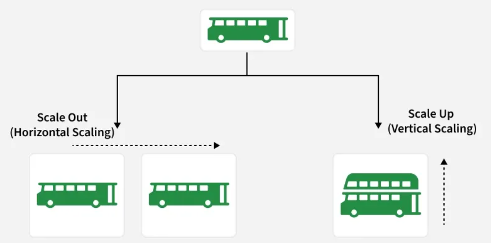

1: Scalability refers to a system’s ability to grow smoothly and handle increased demand while  maintaining performance, reliability, and efficiency.

Handles rising user traffic and workload effectively.
Supports growth in data and computing needs.
Maintains performance under increased load.
Avoids major redesign during expansion.

2: Importance of Scalability in System Design
    Scalability is an important factor in system design, which offers many benefits such as:

    Managing Growth: Handles more users, data, and traffic without losing speed or reliability.
    Improving Performance: Distributes load across resources for faster processing and responses.
    Ensuring Availability: Keeps systems running during traffic spikes or component failures.
    Cost-effectiveness: Scales resources up or down as needed, reducing unnecessary costs.
    Encouraging Innovation: Makes it easier to add new features and adapt to market changes.

3: How to achieve Scalability?

a: Make It Bigger (Vertical Scaling)

Like upgrading a car with a bigger engine for more power.
In tech, it means adding CPU, memory, or storage to the same server.
Suitable for small applications and quick scaling needs.
Limited by hardware, as upgrades can’t continue indefinitely.

b: Get More Cars (Horizontal Scaling)
Like using multiple cars to share the workload.
Adds more servers or instances instead of upgrading one.
Distributes traffic evenly across resources.
Ideal for large applications with many users.

c: Divide and Conquer (Microservices)
Treats the app as small, independent services.
Scales only the required parts instead of the whole system.
Improves flexibility and efficient resource usage.

d: No Servers, No Problems (Serverless)
Removes the need to manage servers.
Automatically scales based on demand.
Cost-efficient for variable and unpredictable workloads.

4: Components that help to increase Scalabilty
Below are some of the main components that help to increase the scalability:

a: Load Balancer: A load balancer distributes incoming traffic across multiple servers to avoid     overload and improve performance and availability.
b: Caching: Caching stores frequently accessed data temporarily to reduce latency and backend load.
c: Database Replication: Database replication creates multiple real-time copies of data to enhance availability and read performance.
d: Database Sharding: Database sharding splits data into smaller shards to scale databases across multiple instances.
e: Microservices Architecture: Microservices architecture divides applications into independent services that can scale separately.
f: Data Partitioning: Data partitioning divides data based on criteria like user or region to improve scalability.
g: Content Delivery Networks (CDNs): CDNs deliver cached content from locations closer to users, reducing latency.
h: Queueing Systems: Queueing systems handle requests asynchronously to manage traffic spikes and prevent overload.

5: Real-World Examples of Scalable Systems
There are many real-world examples of scalable systems that demonstrate the importance and impact of scalability in modern technology.

a: Google: Uses a highly scalable distributed system (Bigtable, MapReduce, Spanner) to handle billions of searches globally.
b: AWS: Offers scalable cloud services that let businesses easily scale compute, storage, and databases on demand.
c: Netflix: Relies on cloud infrastructure, microservices, and caching to stream content to millions of users at once.

6: Challenges and Trade-offs in Scalability
Challenges and trade-offs include:

a: Cost vs. Scalability: Scaling improves performance and availability but often increases infrastructure and operational costs.
b: Complexity: As systems scale, they become harder to manage, maintain, and debug, raising operational overhead.
c: Latency vs. Throughput: There is often a trade-off between latency and throughput. Optimizing for low latency may reduce throughput, and vice versa.
d: Data Partitioning Trade-offs: Partitioning boosts scalability but requires careful balance of partition size, data movement, and data locality.
