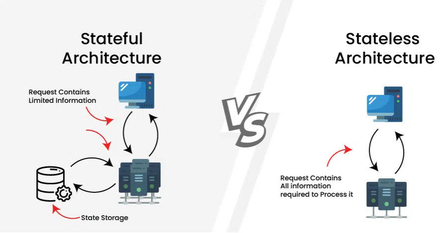

1: Stateful architecture maintains client session data on servers, while stateless architecture treats each request independently.
2: What is Stateful Architecture?
The server maintains the state or session information of each client. This means that the server keeps track of the client's data and context throughout multiple interactions or requests.

Often involve storing session data in server memory, databases, or other storage mechanisms.

3: What is Stateless Architecture?
The server does not store any client session information between requests. Each request from the client is treated as an independent transaction.

To maintain user sessions, stateless architectures often use techniques like JSON Web Tokens (JWT) or client-side cookies to store session data.
Examples include RESTful APIs, where each request contains all the necessary information for the server to process it independently.
Designed to be more scalable and fault-tolerant because they do not require server resources to maintain client state.

4: Benefits of Stateful Architecture: 
a:  Session Persistence: Maintains user sessions, allowing smooth transitions across steps or devices.
b:  Efficient Resource Use: Stores session data on the server, reducing repeated transfers and processing.
c:  Personalization: Uses past interactions to deliver tailored experiences, like recommendations.
d:  Enhanced Security: Centralized session management supports strong authentication and encryption.

5: Benefits of Stateless Architecture: 
a:  High Scalability: Easily handles large numbers of requests without session management.
b:  Fault Tolerance: Each request is independent, so failures in one area don’t affect others.
c:  Simplified Load Balancing: Requests can be evenly distributed without sticky sessions.
d:  Better Performance: No session overhead, resulting in faster responses and lower latency.

| **Parameters**            | **Stateful Architecture**                                     | **Stateless Architecture**                                           |                      |
| ------------------------- | ------------------------------------------------------------- | -------------------------------------------------------------------- | -------------------- |
| **Scalability**           | Scaling requires synchronization of session data              | Horizontal scaling is straightforward                                |                      |
| **Fault Tolerance**       | Failure in one server affects sessions stored on others       | Failures are isolated, impacting only individual requests            |                      |
| **Performance**           | May experience increased latency due to session management    | Typically faster response times due to lack of session overhead      |                      |
| **Resource Usage**        | Requires more resources for session state management          | Utilizes resources efficiently due to lack of session state          |                      |
| **Caching Strategies**    | Caching strategies may be complex due to session data         | Simplified caching strategies without session state                  |                      |
| **Deployment Complexity** | Deployment may be more complex due to session synchronization | Easier deployment and maintenance due to statelessness               |                      |
| **Transaction Integrity** | Ensures transaction integrity by maintaining session context  | Transactions are isolated, ensuring integrity at request level       |                      |
| **Load Balancing**        | Load balancing may require consideration of session affinity  | Simplified load balancing without session considerations             |                      |
| **Development Focus**     | Developers need to manage session-related issues              | Developers can focus more on business logic without session concerns
