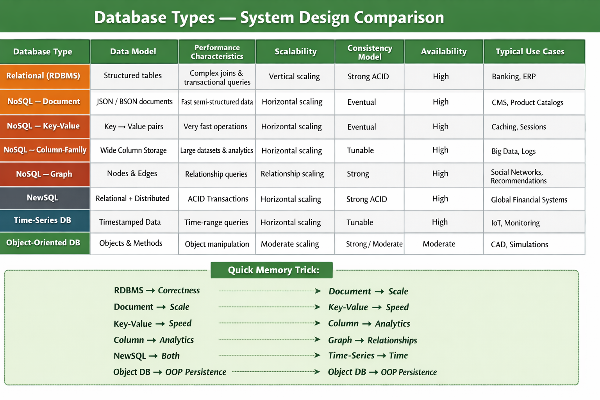

Scenarios for When to Choose Which Database?
Below are the different databases and some scenarios with example of when to choose this database:

1. Relational Databases (RDBMS)
Scenario: An e-commerce platform that need scomplicated query, business transaction and possess good consistency.
Example: Including managing of order through PostgreSQL, managing customers through PostgreSQL and managing stock through PostgreSQL.
2. NoSQL Document Databases
Scenario: A CMS in which flexible schema requirements are required.
Example: To store articles, blog posts, and contents to be mined from users, MongoDB is employed.
3. NoSQL Key-Value Stores
Scenario: An instance of the session storage of a web-application where frequent read and write operations are needed.
Example: Caching the user sessions and configurations to the Redis.
4. NoSQL Column-Family Stores
Scenario: This real-time, high-speed analytics system is responsible for processing big data.
Example: Applying of Cassandra system for storage and processing the results of the users’ interactive sessions.
5. NoSQL Graph Databases
Scenario: A social network application that seems through which people are connected.
Example: The handling and storing of connection between the users through Neo4j.
6. NewSQL Databases
Scenario: An international financial environment with strict adherence to the framework’s conformance and a high degree of adaptability.
Example: Applying Google spanner to control the financial transactions across Multiple regions.
7. Time-Series Databases
Scenario: A system that consumes large amounts of time-series data originating from various sensors and is able to query it.
Example: Storing temperature and humidity values into the database and analyzing it with InfluxDB.
8. Object-Oriented Databases
Scenario: A cad application which deals with multiple large objects and their links.
Example: Applying ObjectDB to manage and persist the designs and models of engineering.

